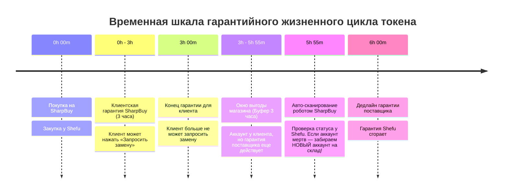

# 🛡️ SHARPBUY: АРХИТЕКТУРА СИСТЕМЫ ГАРАНТИИ И АВТО-ЗАМЕН (WARRANTY & REPLACEMENT ENGINE)

> **Статус документа:** Концепт и техническое проектирование бизнес-логики  
> **Автор идеи:** SharpBuy Team  
> **Интеграция:** Shefu223 API (`nfa.shefu223.shop/?tab=replacement`) + SharpBuy Cloud Database  

---

## 🎯 1. Введение и суть бизнес-модели

У нас есть существенное преимущество в гарантийных сроках:
* **Гарантия для наших клиентов на SharpBuy:** **3 часа** с момента покупки.
* **Гарантия поставщика (Shefu223):** **6 часов** с момента оптовой закупки.

Это открывает два мощных направления:
1. **Клиентский сервис:** Автоматическая замена нерабочего аккаунта в 1 клик для клиента (в течение 3 часов).
2. **Арбитраж свободной гарантии (Free Profit Loop):** Автоматический опрос поставщика за 5 минут до истечения 6 часов (на отметке `5h 55m`). Если аккаунт отлетел у владельца — мы бесплатно забираем новый аккаунт у поставщика на наш склад!



---

## ⚙️ 2. Сценарий №1: Запрос замены клиентом (0 — 3 часа)

### Пользовательский путь (User Journey)
1. **Ссылка из письма:** В каждом чеке на Email под таблицей с инструкцией размещается кнопка:  
   `[ 🛡️ ЗАПРОСИТЬ ЗАМЕНУ ПО ГАРАНТИИ ]` (ведет на `https://sharpbuy.org/warranty` с авто-заполнением токена).
2. **Страница гарантии:** Клиент вводит свой выданный токен (`username----token`).
3. **Робот SharpBuy выполняет проверку:**
   * Сверяет токен в `orders_database.json` и находит связанный заказ и Email.
   * Вычисляет: `Прошедшее_Время = Date.now() - order.paidAt`.
   * **Если `> 3 часов`:** Выдает вежливое сообщение:  
     *«Срок гарантийного обслуживания (3 часа) истек. Замена невозможна.»*
   * **Если `< 3 часов`:** Робот делает фоновый запрос к API поставщика `https://nfa.shefu223.shop/api/replacement`.

### Варианты ответа поставщика:
* **Вариант А (Аккаунт действительно мертв / пароль изменен):**
  Поставщик отдает новый рабочий токен.
  * Сервер обновляет запись в `orders_database.json` (статус `REPLACED`, новый токен).
  * Новый токен мгновенно отображается на экране клиента с кнопкой «Скопировать токен».
  * На Email клиента отправляется дубликат: *«Ваш аккаунт был успешно заменен по гарантии»*.
  * Токен обновляется в **профиле пользователя (истории заказов)** и в локальном файле `steam.txt`.
* **Вариант Б (Аккаунт на самом деле рабочий):**
  Поставщик проверяет вход и отвечает, что аккаунт валидный.
  * Сервер сообщает клиенту: *«Проверка показала, что аккаунт полностью валиден и пароль не менялся. Убедитесь, что вы используете наш официальный SharpBuy_Launcher.exe.»*

---

## 💎 3. Сценарий №2: Авто-арбитраж и сбор бесплатных аккаунтов (5h 55m)

> [!TIP]
> **Как это увеличивает прибыль магазина:**  
> Многие покупатели играют на аккаунте 1–2 часа и выходят. Если через 4–5 часов владелец восстанавливает свой Steam, клиент уже не просит замену (его 3 часа прошли). Но у нас остается еще 1 час гарантии от поставщика! Мы забираем замену себе на склад и продаем ее повторно за 100% чистую прибыль.

### Логика работы фонового Cron-демона:
1. Каждые **5 минут** фоновый процесс сканирует `orders_database.json`.
2. Ищет все заказы со статусом `PAID_DELIVERED`, у которых:
   `5 часов 50 минут <= Возраст_Заказа <= 5 часов 58 минут`.
3. Для каждого такого токена робот асинхронно отправляет запрос на замену поставщику:
   `POST https://nfa.shefu223.shop/api/replacement { token: "username----token" }`
4. **Результат:**
   * Если аккаунт был восстановлен владельцем ➔ Shefu отдает **новый лицензионный токен**!
   * Робот добавляет этот новый токен в `src/data/stock_nfa_prime.json` и в `steam.txt` с пометкой `[ARBITRAGE FREE REPLACEMENT]`.
   * Магазин получает абсолютно бесплатный товар себе на склад.

---

## 📊 4. Модуль статистики и аналитики экономии (`warranty_stats.json`)

Система ведет постоянный аудит всех замен и сохраняет детальную финансовую статистику:
* **`totalClientReplacements`**: Сколько замен выдано клиентам (спасенная репутация и довольные отзывы).
* **`totalArbitrageHarvested`**: Сколько бесплатных аккаунтов забрано у поставщика на отметке `5h 55m`.
* **`arbitrageProfitUsd`**: Общая сумма заработанных денег на бесплатных арбитражных заменах (в $ и ₽).
* **`warrantyAuditLog`**: История каждого запроса с таймштампами, старыми и новыми токенами.

---

## 📋 5. Сводная таблица правил и условий

> [!NOTE]
> **Почему на Ножи / Скины / Rust нет гарантии:**  
> Это официальное правило поставщика Shefu223: аккаунты с дорогим инвентарем и Rust продаются как «AS-IS» (без гарантии замены). Аккаунты с Prime, Premier и Медалями — имеют полную 6-часовую гарантию.

| Категория товара | Гарантия клиенту (SharpBuy) | Гарантия поставщика (Shefu) | Доступна ли замена? | Участвует в авто-сборе (5h 55m)? |
| :--- | :---: | :---: | :---: | :---: |
| **CS2 Prime Account** | 3 часа | 6 часов | ✅ Да | ✅ Да (на отметке 5ч 55м) |
| **CS2 Premier Ready** | 3 часа | 6 часов | ✅ Да | ✅ Да (на отметке 5ч 55м) |
| **CS2 4+ / 5+ / 8+ Medals** | 3 часа | 6 часов | ✅ Да | ✅ Да (на отметке 5ч 55м) |
| **CS2 Premier Rating** | 3 часа | 6 часов | ✅ Да | ✅ Да (на отметке 5ч 55м) |
| **CS2 Knife / Glove** | Без гарантии | Без гарантии *(правило Shefu)* | ❌ Нет | ❌ Нет |
| **CS2 $50-$350 Inventory** | Без гарантии | Без гарантии *(правило Shefu)* | ❌ Нет | ❌ Нет |
| **Rust Account** | Без гарантии | Без гарантии *(правило Shefu)* | ❌ Нет | ❌ Нет |

---

## 📧 6. Макет кнопки в чеке на Email

В письме подтверждения под блоком данных аккаунта добавляется гарантийный баннер:

```html
<div style="background: rgba(232, 88, 58, 0.08); border: 1px solid rgba(232, 88, 58, 0.25); border-radius: 12px; padding: 16px; text-align: center; margin-top: 20px;">
  <p style="color: #ffffff; font-size: 13px; font-weight: bold; margin: 0 0 8px 0;">🛡️ Гарантия SharpBuy Care: 3 часа с момента покупки</p>
  <p style="color: rgba(255, 255, 255, 0.6); font-size: 11px; margin: 0 0 12px 0;">Если аккаунт перестал работать в течение 3 часов — получите мгновенную авто-замену в 1 клик:</p>
  <a href="https://sharpbuy.org/warranty?token={{TOKEN}}" style="display: inline-block; background: #E8583A; color: #ffffff; font-size: 12px; font-weight: 900; text-decoration: none; padding: 10px 24px; border-radius: 8px; text-transform: uppercase;">Запросить замену по гарантии</a>
</div>
```

---

## 🚀 7. Готовность к внедрению
Архитектура полностью продумана, учтены все финансовые и клиентские сценарии. Модуль готов к разработке по твоей команде!
